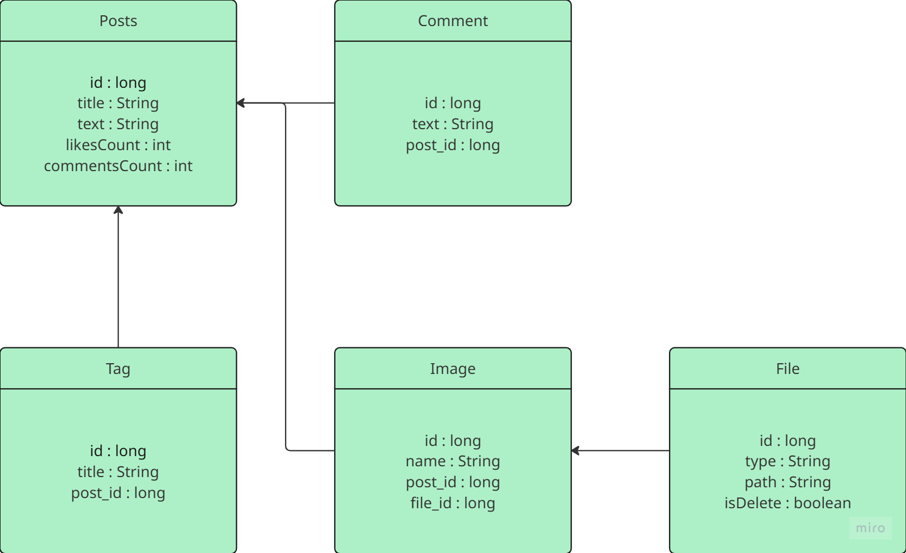

# Бэкенд веб-приложения блога написан с использованием Spring Framework (версия 6.1 и выше),

выполняющегося в любом из современных сервлет-контейнеров Tomcat/Jetty.

## Схема базы данных

## Сборка проекта 
Проект основан на jdk 21
1. сборка в maven по команде `mvn clean package`
2. разворачивания контейнера в докере команда `docker-compose up -d`